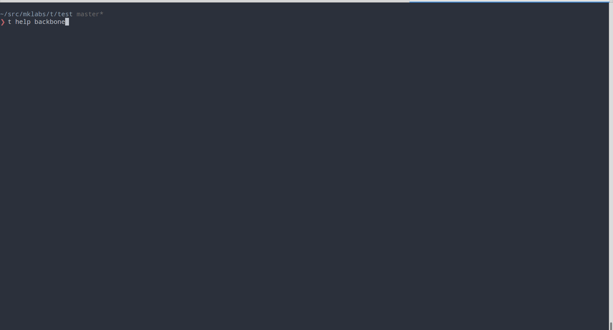
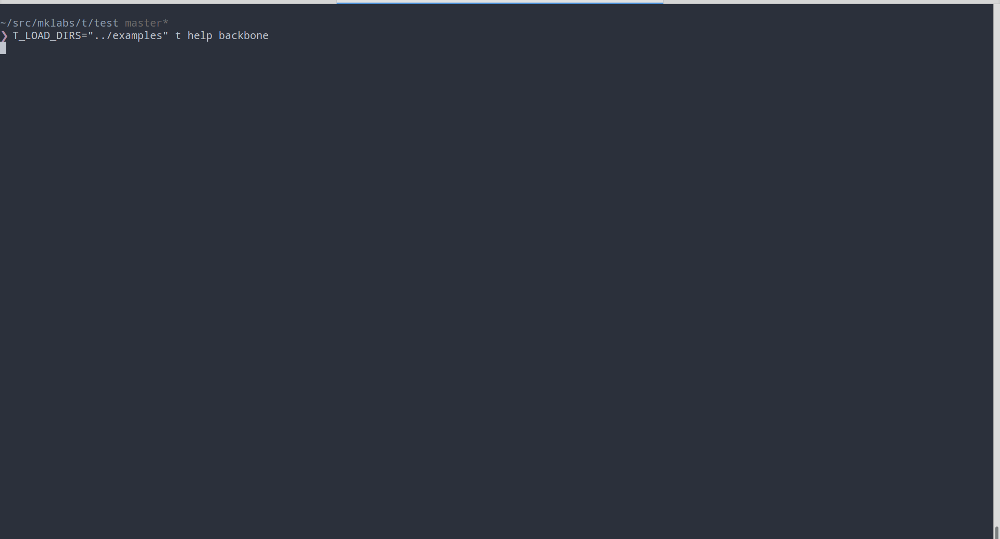

# t

**Tiny scafolding engine**

## Install

    npm i mklabs/t -g

Using the [./examples](./examples) directory in this repo:

    $ git clone git@github.com:mklabs/t.git
    $ cd t/
    $ T_LOAD_DIRS="./examples" t # no arguments enters Vorpal REPL
    t> help

## Usage

    $ t <command> [options]

      Templates are loaded from a predefined set of directories,
      configurable via the T_LOAD_DIRS environment variable :

        - ./templates
        - ./.templates
        - ~/.config/templates
        - ~/.vim/templates

      Ex: T_LOAD_DIRS="./.templates ~/.dotfiles/templates ~/.local/templates" t

      Standard Handlebars templates, any placeholder variables `{{ variable }}`
      not found in the command line options is prompted automatically.

      The optional front comment can be used to specify CLI [options],
      define an output location or a custom description for the command.

      Running `t` without arguments enters Vorpal REPL mode, exposing
      the same commands and options.

    Commands:

      backbone [options]          Generates index.html, js/app.js, js/model.js
      backbone:model [options]    Generate a basic Backbone model
      backbone:router [options]   Generate a basic Backbone Router
      html [options]              Generates a default HTML file
      package.json [options]      Generates a JSON file (name, versi…, descr…, main, scrip…, autho…, licen…)

---



## Templates

Any valid Handlebars template can be used as a source for a new command,
without the need to interact with the API directly.

Instead, the scafolding system relies on a few conventions, and a minimalist
DSL available in templates (usually used within comments) allowing the definition of:

- output - Define a default output location
- options - Specify a command line option with default value, alias, etc.
- description - The comment block or line at the top of the template file, used
  to build `--help` list.

Templates are also parsed to search for Handlebars placeholder `{{ var }}` and
initialize a set of questions to ask when no default value matches the provided
command line options.

**Example**

```html
<!-- Generate a default HTML file  -->
<!doctype html>
<html lang="en">
<head>
  <meta charset="utf-8">
  <meta http-equiv="X-UA-Compatible" content="IE=edge,chrome=1">
  <title>{{ title }}</title>
  <meta name="description" content="{{ description }}">
  <meta name="viewport" content="width=device-width">
</head>
<body>
    {{ body }}
</body>
</html>
```

```javascript
// Generate a basic Backbone model
//
// output: ./models/{{ name }}.js

var {{ name }} = Backbone.Model.extend({
  initialize: function () {

  }
});
```
Templates can be nested indefinitely, `/` in file paths are converted into `:`,
so a template file located at `es6/functions/arrow.js` would be available via
`t es6:functions:arrow`.

### App templates

Directories named `app/` are treated a bit differently and registered as a
single command. They can contain any number of template files, and any
hierarchy of folders.

They're usefull when generating a bunch of files, or a project layout.

**Example [./examples/backbone/app](./examples/backbone/app)**

```
examples/backbone/app/
├── index.html
└── js
    ├── app.js
    └── model.js

1 directory, 3 files
```


